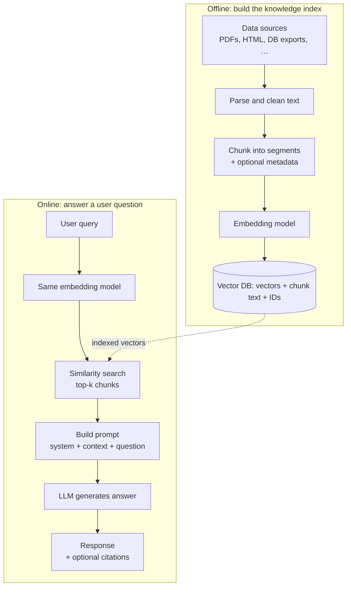
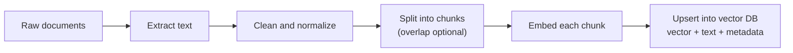
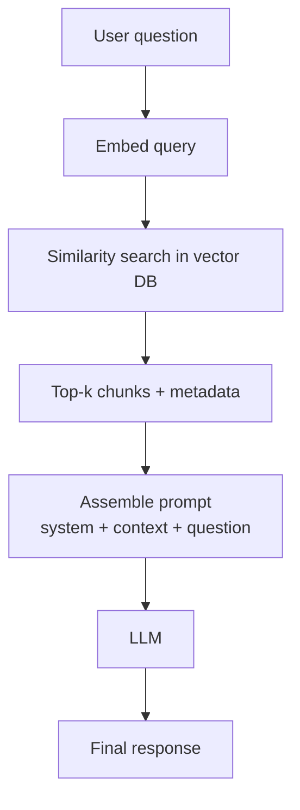
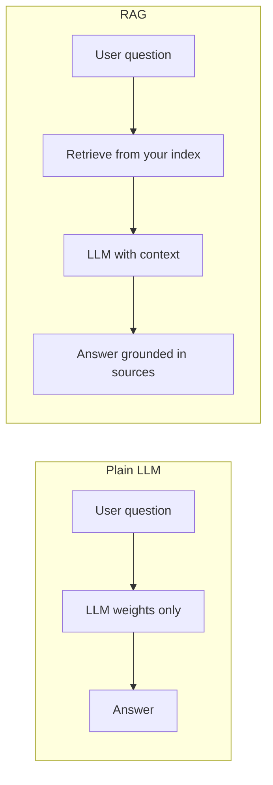

# Part 1: Retrieval-Augmented Generation (RAG)

Notes from introductory slides on RAG, expanded with extra context: what it is, why it matters, how the pieces connect, and how a typical system runs in practice.

---

## What is RAG?

**Retrieval-Augmented Generation (RAG)** is a pattern where an LLM **does not answer only from memory**. Instead, the system **retrieves** relevant passages from an **external** store, puts them in the prompt as **context**, and asks the model to **generate** an answer that stays faithful to that context.

In one sentence: **retrieve evidence first, then generate with that evidence in view.**

### How it differs from other ways to “teach” a model

| Approach | Idea | Typical use |
|----------|------|-------------|
| **Prompting only** | You describe the task in the prompt; no persistent knowledge store. | Quick tasks, small facts in the prompt. |
| **RAG** | Knowledge lives in **documents + vector index**; each query pulls fresh snippets. | Internal wikis, policies, product docs, research corpora. |
| **Fine-tuning** | **Weights** change on your data; model “absorbs” patterns. | Stable style, specialized behavior, repeated domain phrasing. |

RAG and fine-tuning are **not mutually exclusive**: many products use RAG for **facts that change** and fine-tuning for **tone or format**. RAG is especially strong when answers must **cite** or **track** sources that update often.

### Benefits (why teams adopt it)

- **Grounding:** Answers can be tied to **specific chunks** you control, which reduces confident nonsense about *your* domain (it does not remove all hallucinations—see below).
- **Freshness:** Update the index when docs change; no full retrain of the LLM.
- **Privacy & boundaries:** Data stays in **your** storage and retrieval layer; you choose what gets embedded and who can query it.
- **Cost vs. full retraining:** Building and maintaining an index is often cheaper than repeatedly training large models for every doc change.
- **Explainability:** You can show **which passages** were retrieved (useful for debugging and trust).

---

## Why is RAG needed? (Limits of a plain LLM)

A standard LLM answers from **weights learned during training** plus whatever you put in the **prompt**. That design hits real limits:

| Issue | What goes wrong | How RAG helps |
|--------|-----------------|---------------|
| **Hallucinations** | The model can state false things **confidently** because it is optimizing for plausible text, not truth. | Retrieved context **constrains** the answer space; you can also ask the model to **only** use the context and say “I don’t know” if missing. |
| **Stale knowledge** | Training has a **cutoff**; the model has no built-in browser or file system. | Your index can be **rebuilt** when sources change. |
| **No private data** | Public models never saw your HR handbook, codebase, or customer-specific runbooks. | You **ingest** those docs into **your** index. |
| **Context window limits** | Even a huge window cannot hold **all** company knowledge at once—and stuffing irrelevant text **hurts** quality. | Retrieval sends **only the top-k relevant chunks** for *this* question. |
| **No built-in attribution** | Raw completion does not point to a page and paragraph. | Chunks can carry **metadata** (file, URL, section) for citations. |

**Important nuance:** RAG **reduces** off-topic or ungrounded answers; it does **not** guarantee correctness. The retriever can miss the right chunk, or the LLM can still **ignore** or **misread** context. Later parts cover evaluation and failure modes.

---

## Big-picture flow (both pipelines)

This diagram shows **offline ingestion** (runs when you add or update knowledge) and **online query** (runs per user question).

**Reading the diagram:** The vector database is populated **before** users ask questions. At query time, the retriever **reads** from that index; the LLM never trains on your docs in the classic RAG setup—it **reads** them as context in the prompt.

---

## The RAG architecture (detailed)

### 1. Data ingestion pipeline

**Goal:** Turn messy source files into **searchable vectors** that still **map back** to human-readable text (and metadata).

#### Steps in more detail

1. **Data sources**  
   Anything you can turn into text: PDFs, Confluence/HTML, Slack exports, tickets, spreadsheets, SQL query results. Quality of **extraction** (especially PDFs and tables) strongly affects downstream answers.

2. **Parsing and cleaning**  
   Remove boilerplate, fix encoding, normalize whitespace, optionally strip headers/footers. Bad parsing → garbage chunks → bad retrieval.

3. **Chunking**  
   Split documents into pieces (often hundreds to a couple thousand **tokens**, depending on the embedding model and use case).  
   - Too **large**: one chunk mixes many topics; similarity search gets fuzzy.  
   - Too **small**: sentences lose surrounding context; meaning is fragmented.  
   Overlap between consecutive chunks is common so sentences at boundaries are not cut in half without context.

4. **Embedding**  
   An **embedding model** maps each chunk to a **dense vector** (a list of floats). **Semantically similar** texts tend to land **closer** in vector space than unrelated texts.  
   The **same** model (or strictly compatible dimensions and training) should be used at query time so query vectors and document vectors are comparable.

5. **Indexing in a vector database**  
   Store at least: **vector**, **chunk text**, and an **id** (plus metadata: `source_file`, `page`, `heading`, `updated_at`, etc.). The DB supports **fast approximate nearest neighbor** search at scale.

#### Ingestion-only flowchart

#### When ingestion runs

- **Batch:** Nightly or on every doc merge (good for stable corpora).  
- **Near real-time:** Event-driven updates when a CMS or git repo changes (more moving parts).  

---

### 2. Retrieval and generation pipeline

**Goal:** For a **single** user question, find the **best supporting chunks** and produce an answer that uses them well.

#### Steps in more detail

1. **User query**  
   Natural language question (possibly after **query rewriting** or **hybrid** keyword + semantic search in advanced systems—Part 1 stays with the basic version).

2. **Query embedding**  
   The query is embedded with the **same** embedding model used for chunks. The output is one vector representing “what this question is about.”

3. **Retriever (similarity search)**  
   Compare the query vector to chunk vectors (e.g. **cosine similarity** or **dot product** on normalized vectors). Return the **top-k** chunks (k might be 3–20 depending on chunk size and model context).  
   Some systems add **re-ranking**: a second, heavier model scores `(query, chunk)` pairs for better precision.

4. **Context + prompt**  
   A typical template has:  
   - **System:** “You are a helpful assistant; answer only using the context; if the answer is not in the context, say you do not know.”  
   - **Context:** The retrieved chunks, often labeled `Source 1`, `Source 2`, …  
   - **User:** The original question.  
   Good prompts **explicitly** separate context from instructions to reduce the model blending in parametric “memory.”

5. **Generation**  
   The LLM produces the final answer. Optional: require **citations** (“According to Source 2 …”), bullet summaries, or structured JSON for apps.

#### Query-time flowchart

**Example product angle:** Tools like **Perplexity** combine web retrieval (not only your vector DB) with an LLM; the **shape** of the pipeline—retrieve, then generate with context—is the same idea.

---

## Conceptual comparison: without RAG vs with RAG

---

## Quick recap

1. **Ingest (offline):** documents → extract/clean → chunk → embed → store vectors + text + metadata.  
2. **Query (online):** question → embed → retrieve top-k → build prompt → LLM → answer (ideally with traceability to chunks).  
3. **RAG** improves relevance and grounding for **your** data and **changing** knowledge; it is not a substitute for **evaluation**, **good chunking**, or **safe prompting**.

---

## Where later parts can go deeper

- Chunking strategies, overlap, and document structure (headings, tables).  
- Embedding models, distance metrics, and re-rankers.  
- Vector databases vs. libraries, filters, and hybrid search.  
- Evaluation (retrieval recall, answer faithfulness), observability, and common failure modes.
