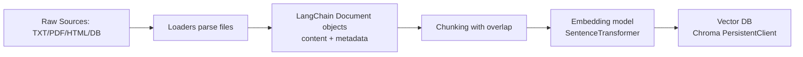
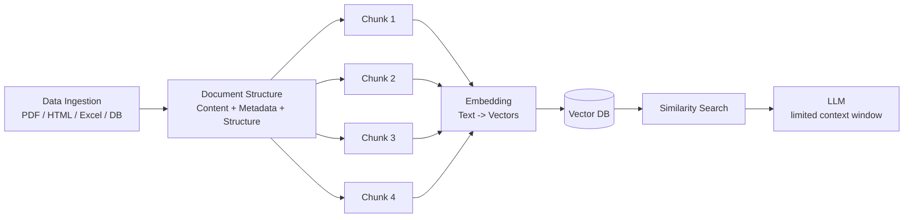
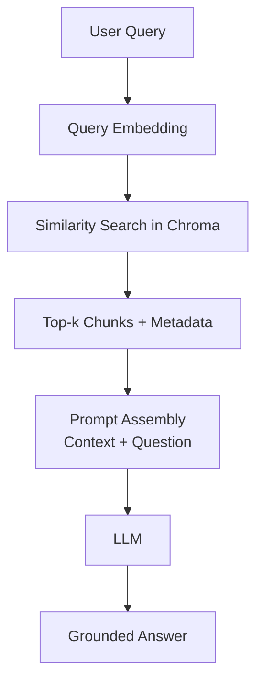

# Part 2: Document Structure and Complete RAG Pipeline

Exam-ready notes based on your slide content, expanded with flowcharts and aligned to your `notebook/document.ipynb` implementation.

---

## 🧠 RAG Pipeline - Quick Notes

## 📌 Agenda

1. Document Structure  
2. Complete RAG Pipeline
   - Data Ingestion Pipeline
   - Query Retrieval Pipeline

---

## 📄 1. Document Structure

- Input data can be:
  - PDF
  - HTML
  - Excel
  - Database

- Each document consists of:
  - **Content**
  - **Metadata**
  - **Structure**

- **Data Parsing -> Structured Document**
  - Convert raw data into a usable structured format

### Notebook mapping

In your notebook, this appears through LangChain `Document` objects and loaders:
- Manual `Document(...)` example with metadata
- `TextLoader` and `DirectoryLoader` for `.txt`
- `PyMuPDFLoader` for PDFs

---

## ⚙️ 2. Data Ingestion Pipeline

### Step-by-step

1. **Load Data**
2. **Parse Documents**
3. **Chunking**
   - Split document into smaller parts (`Chunk1`, `Chunk2`, ...)
   - Helps with:
     - Efficient retrieval
     - Model context limits
4. **Embedding**
   - Convert text -> vectors
   - Captures semantic meaning
5. **Store in Vector DB**
   - Store embeddings
   - Enables fast similarity search

### Ingestion flowchart



### Slide-style flowchart (like your screenshot)



---

## 🧩 Key Concepts

### 🔹 Chunking

- Break large text into smaller pieces
- Important for:
  - Context size limits
  - Better retrieval accuracy
- In notebook: `RecursiveCharacterTextSplitter(chunk_size=1000, chunk_overlap=200)`

### 🔹 Embeddings

- Text -> numerical vector representation
- Similar meaning -> closer vectors
- In notebook: `all-MiniLM-L6-v2` using `SentenceTransformer`

### 🔹 Vector Database

- Stores embeddings
- Supports:
  - **Similarity Search**
  - Fast retrieval of relevant chunks
- In notebook: Chroma persistent storage at `../data/vector_store`

---

## 🔍 3. Query Retrieval Pipeline

1. User query -> converted to embedding
2. Perform **similarity search** in vector DB
3. Retrieve top relevant chunks
4. Send to LLM as **context**

### Retrieval flowchart



---

## 🤖 LLM Context

- LLM has **limited context size**
- Only selected chunks are passed
- Better chunking -> better answers

---

## ⚡ One-Line Flow

**Raw Data -> Parse -> Chunk -> Embed -> Store (Vector DB) -> Query -> Retrieve -> LLM Answer**

---

## Notebook Examined: What your current notebook does

Your `notebook/document.ipynb` currently has this practical sequence:

1. **Creates/loads documents** from text and PDFs  
2. **Chunks documents** with recursive character splitter  
3. **Builds embeddings** using `EmbeddingManager`  
4. **Stores vectors** with custom `VectorStore` class into Chroma  
5. **Retrieves similar chunks** using `RAGRetriever.retrieve(...)`

### Full implementation flow (from your notebook classes)

```mermaid
flowchart TB
  subgraph Ingestion
    L1[TextLoader / DirectoryLoader / PyMuPDFLoader]
    L2[split_documents()]
    L3[EmbeddingManager.generate_embeddings()]
    L4[VectorStore.add_documents()]
    L1 --> L2 --> L3 --> L4
  end

  subgraph Retrieval
    R1[User query]
    R2[EmbeddingManager.generate_embeddings(query)]
    R3[VectorStore.search_similar()]
    R4[RAGRetriever.retrieve()]
    R1 --> R2 --> R3 --> R4
  end
```

---

## Execution order checklist (important for notebook runs)

When rerunning from a fresh kernel, execute in this order:

1. Imports
2. Loaders + document loading
3. Chunking (`chunks` creation)
4. `EmbeddingManager` class + `embedding_manager = EmbeddingManager()`
5. `VectorStore` class + `vectorstore = VectorStore()`
6. Embedding generation + `vectorstore.add_documents(...)`
7. `RAGRetriever` + retrieval queries

If you skip order, common error:
- `NameError: embedding_manager is not defined`

---

## Quick interview-ready answers

- **Why chunking?**  
  To fit context limits and improve retrieval precision by indexing smaller semantic units.

- **Why embeddings?**  
  They represent semantic meaning numerically so similar text can be found via vector distance.

- **Why vector DB?**  
  It stores and indexes embeddings for fast nearest-neighbor search at query time.

- **Why RAG over plain LLM?**  
  RAG grounds answers in external, updatable knowledge instead of only model memory.

---

## Pitfalls students usually miss

- Re-running ingestion without dedup logic can add duplicate chunks.
- Using a different embedding model for query vs documents reduces retrieval quality.
- Bad PDF parsing quality leads to low-quality chunks and poor answers.
- Running cells out of order causes state errors in notebook sessions.

