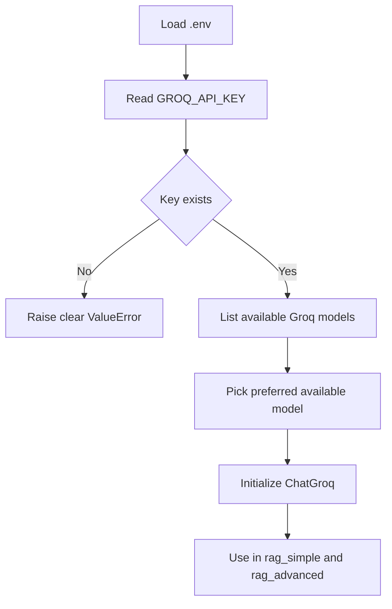
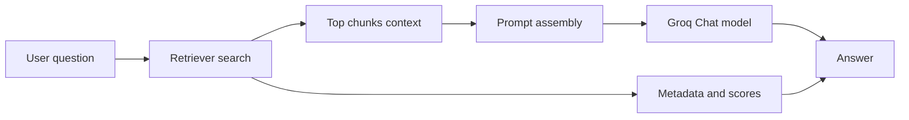
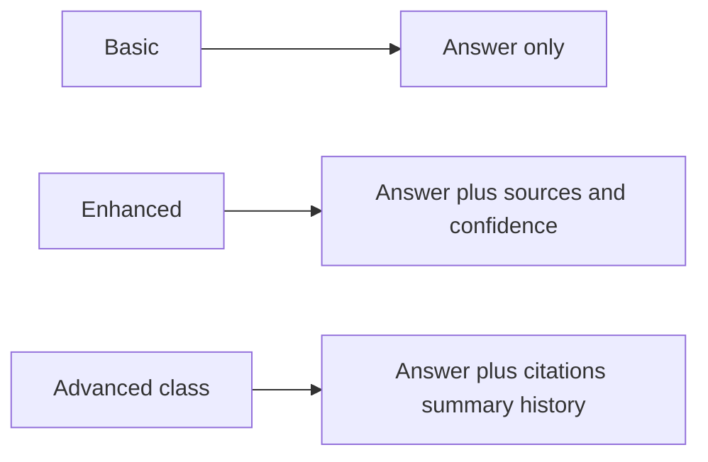
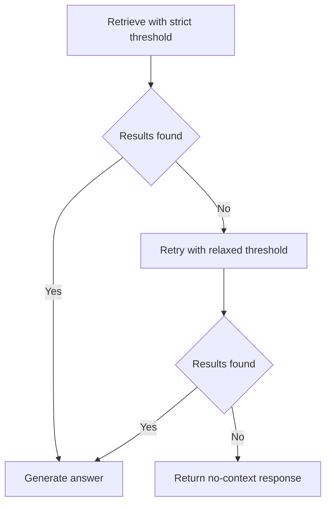

# Part 3: RAG APIs, LLM Integration, and Advanced Query Pipeline

Detailed continuation after Part 2, focused on API usage, environment setup, Groq LLM integration, and the advanced notebook flow.

---

## Agenda

1. What changed after Part 2 in the notebook
2. API keys and `.env` management
3. Groq API integration with LangChain
4. Simple RAG vs Advanced RAG behavior
5. Error analysis and debugging guide
6. Production-minded improvements

---

## 1) What happens after Part 2 in your notebook

After Part 2 (ingestion + embeddings + vector store + retriever), the notebook adds:

- LLM integration using Groq (`ChatGroq`)
- A `rag_simple(...)` function for quick QA
- A `rag_advanced(...)` function with:
  - score threshold filtering
  - sources list
  - confidence score
  - optional full context return

At this stage, your system becomes full RAG:

- Retrieval chooses relevant chunks
- LLM generates natural-language answer from retrieved context

---

## 2) API keys and `.env` setup

## Why `.env` is used

- Keeps secrets out of notebook code
- Easy to rotate keys
- Prevents accidental key leaks in commits

## Project location

Create this file at project root:

- `E:/RAG-BASICS/.env`

Recommended variables:

```env
GROQ_API_KEY=your_groq_key
OPENAI_API_KEY=optional_if_used
HF_TOKEN=optional_if_used
```

## Loading environment variables in notebook

```python
from dotenv import load_dotenv
import os

load_dotenv()
groq_api_key = os.getenv("GROQ_API_KEY")
```

If `groq_api_key` is empty, calls to Groq fail. Always validate and raise a clear error early.

---

## 3) Groq API integration in your notebook

Your notebook now uses:

- `langchain_groq.ChatGroq` for LLM calls
- `groq.Groq` client for listing available model IDs dynamically

## Why dynamic model listing was needed

You previously used a hardcoded model that was decommissioned (`gemma2-9b-it`), causing:

- `BadRequestError`
- `model_decommissioned`

Dynamic model listing fixes this by selecting a currently available model.

## Flow used in your updated cell



---

## 4) Query execution pipeline after API integration

Your query-time pipeline now is:

1. User asks question
2. Retriever embeds query
3. Vector DB similarity search returns top chunks
4. Prompt is built with retrieved context
5. Groq LLM generates answer
6. Advanced function optionally returns sources and confidence



---

## 5) Basic vs Enhanced vs Advanced (all three notebook versions)

Your notebook now contains three levels of RAG query handling:

## A) Basic (`rag_simple`)

- Minimal query flow: retrieve context, send prompt, return answer text
- Fast for first testing
- No explicit confidence score
- Limited response metadata

## B) Enhanced (`rag_advanced`)

- Adds structured output fields
- Supports retrieval filtering with:
  - `top_k`
  - `min_score`
- Returns:
  - `answer`
  - `sources`
  - `confidence`
  - optional `context`
- Better for debugging and evaluation than basic flow

## C) Advanced class-based pipeline (`AdvancedRAGPipeline`)

- Wraps the full flow in a reusable class
- Adds richer application features:
  - citations appended to answer text
  - optional streaming output behavior
  - optional answer summarization
  - query history memory (`self.history`)
  - structured dictionary output for downstream apps

This third version is the most product-oriented stage in your notebook.

### Side-by-side comparison

| Feature | Basic (`rag_simple`) | Enhanced (`rag_advanced`) | Advanced (`AdvancedRAGPipeline.query`) |
|---|---|---|---|
| Retrieval | Yes | Yes | Yes |
| `top_k` control | Yes | Yes | Yes |
| Score threshold | No explicit parameter | Yes (`min_score`) | Yes (`min_score`) |
| Sources returned | No | Yes | Yes |
| Confidence score | No | Yes | Indirect via source scores |
| Context return option | No | Yes (`return_context`) | Context used internally |
| Citations in final answer | No | No (sources returned separately) | Yes (appended) |
| Streaming behavior | No | No | Optional (`stream=True`) |
| Summarization | No | No | Optional (`summarize=True`) |
| History tracking | No | No | Yes (`history`) |

### Execution flow evolution



---

## 6) Why advanced sometimes says “No relevant context found”

Key reason: stricter filtering.

- `rag_simple` commonly uses permissive retrieval
- `rag_advanced` filters by `min_score`
- If no result crosses threshold, it returns no context

Typical causes:

- strict `min_score`
- typo-heavy query wording
- chunk does not contain exact phrasing
- embedding mismatch quality

Practical tuning:

- Start with `min_score=0.0` or `0.05`
- Increase slowly only after testing multiple questions

Important in your current notebook:

- The advanced class also uses `min_score`, so strict values can still return empty context.
- If you want fewer empty responses, start class queries with `min_score=0.05` and adjust after testing.

---

## 7) Common errors you hit and what they mean

## A) `NameError: embedding_manager is not defined`

Cause:
- cells were run out of order after kernel restart

Fix:
- rerun setup cells in order before query cell

## B) Groq `BadRequestError: model_decommissioned`

Cause:
- hardcoded retired model name

Fix:
- choose active model from Groq model list

## C) “No relevant context found”

Cause:
- retrieval returned empty after threshold filtering

Fix:
- lower `min_score`, increase `top_k`, and verify chunk quality

---

## 8) API and notebook best practices (important)

- Keep keys only in `.env`, never in notebook source
- Add `.env` to `.gitignore`
- Validate required keys at startup
- Print selected model once for transparency
- Log retrieval scores for debugging
- Keep `top_k` and threshold configurable
- Use graceful fallback when no context is found

---

## 9) Suggested robust version of advanced flow

Use two-stage retrieval:

1. Try strict threshold (`min_score=0.15`)
2. If empty, retry relaxed threshold (`0.0`)

This keeps quality high while reducing empty-answer cases.



---

## 10) Clear run order for post-Part-2 cells

When restarting kernel, run in this order:

1. Retriever and embedding setup cells
2. `.env` loading and Groq initialization cell
3. `rag_simple` / `rag_advanced` function cell
4. question execution cell

If skipped:

- key errors
- undefined variable errors
- outdated model errors

---

## Quick recap

- Part 2 built retrieval foundation
- Part 3 connects retrieval to a real API LLM
- `.env` + model validation are essential reliability steps
- advanced RAG adds source traceability and confidence
- threshold tuning controls recall vs precision

